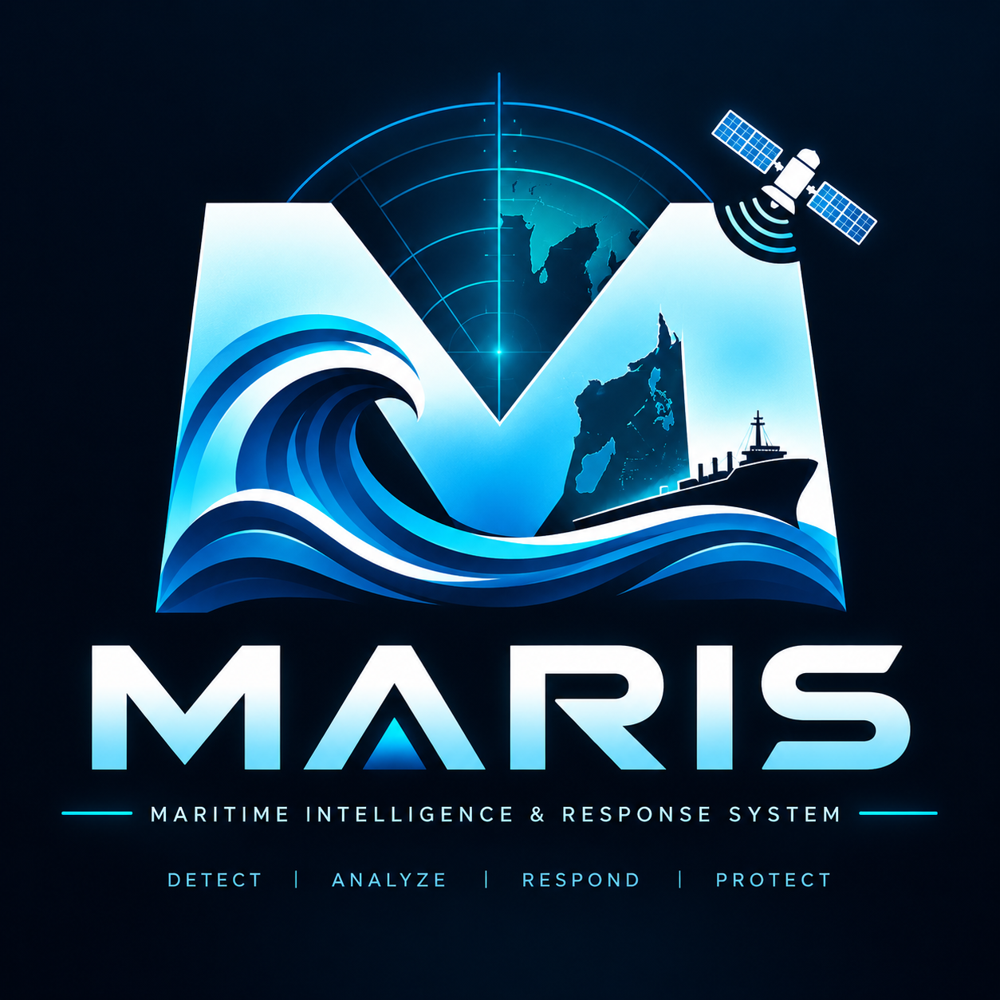
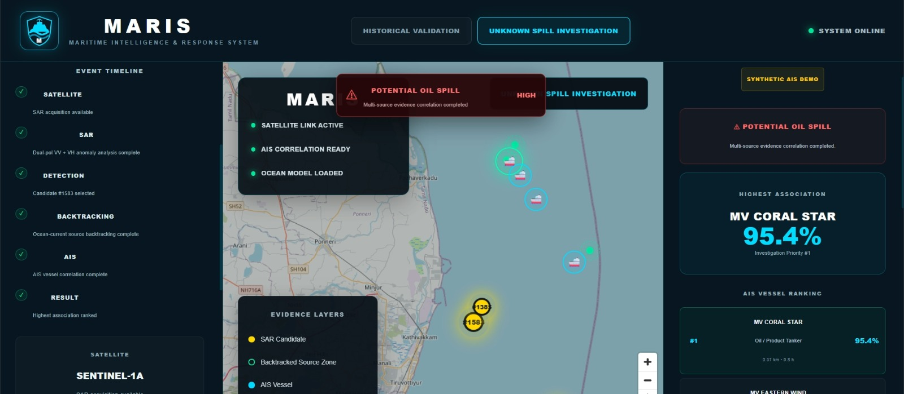
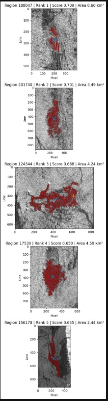
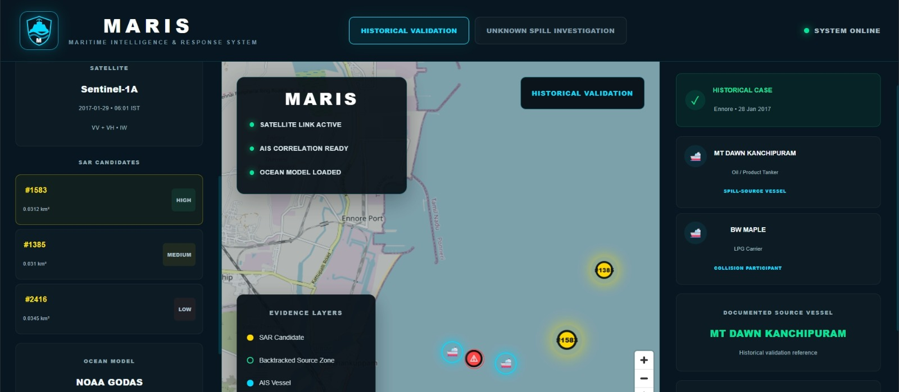
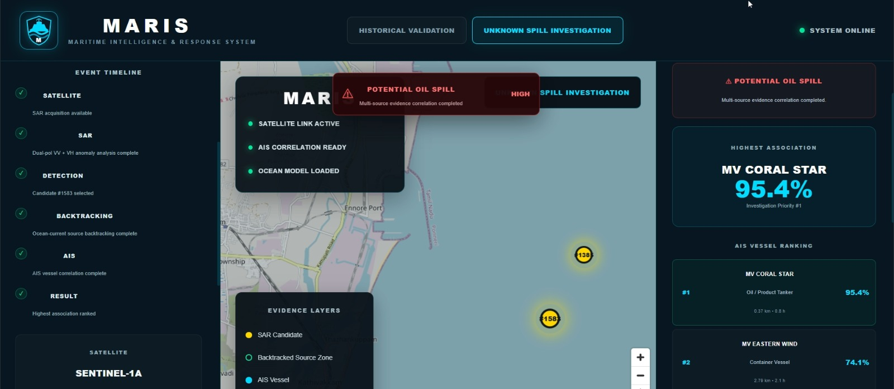

# 🚢 MARIS — Maritime Intelligence & Response System

<p align="center">



</p>

## 🌊 Overview

**MARIS (Maritime Intelligence & Response System)** is an explainable maritime intelligence platform designed to detect potential oil spills, estimate their probable source zones, and correlate them with vessel movement data.

MARIS combines:

- 🛰️ Sentinel-1 SAR imagery
- 🌊 Ocean-current backtracking
- 🚢 AIS vessel data
- 🧠 Explainable scoring
- 📍 Geospatial visualization
- 🚨 Investigation alerts

The goal is to transform fragmented maritime data into an **evidence-based investigation workflow**.

---

## 🎯 Problem Statement

Oil spills at sea can spread rapidly, making it difficult to determine their original source.

Traditional investigation requires analysts to manually combine:

> Satellite imagery + Ocean dynamics + Vessel movement + Historical information

MARIS brings these data sources together into a single investigation platform.


## 🛰️ Key Features
1. Satellite-Based Detection

MARIS processes Synthetic Aperture Radar (SAR) imagery to identify potential maritime dark anomalies.

The system uses Sentinel-1 SAR information including:

> VV polarization
> VH polarization
> Backscatter characteristics
> Spatial anomaly detection

2. SAR Candidate Detection

Instead of immediately declaring an anomaly as an oil spill, MARIS generates potential candidates for further investigation.

> Example:

> SAR CANDIDATES

> #1583
> #1385
> #2416

Each candidate can be examined spatially on the interactive map.

3. Ocean Backtracking

Oil does not remain stationary.

MARIS uses ocean-current information to estimate how a detected slick could have moved through the water.

> Detected Slick
      │
      ▼
> Ocean Current
      │
      ▼
> Backward Trajectory
      │
      ▼
> Probable Source Zone

This allows the system to investigate the origin of the spill, rather than only its detected location.

4. AIS Vessel Correlation

Once a probable source zone is estimated, MARIS correlates nearby vessels using AIS information.

The system considers:

> Spatial proximity
> Temporal proximity
> Vessel relevance

Example:

MV CORAL STAR

Distance: 0.37 km
Time Difference: 0.8 h

Association Score: 95.4%
5. Explainable Investigation

MARIS does not simply output:

"This vessel caused the spill."

Instead, it provides an association score based on available evidence.

> SPATIAL PROXIMITY       45%
> TEMPORAL PROXIMITY      30%
> VESSEL RELEVANCE        25%
> ────────────────────────────
> ASSOCIATION SCORE       95.4%

Association does not establish legal liability.

## 🗺️ System Screenshots
🖥️ MARIS Dashboard
<p align="center">  </p>
🛰️ SAR Anomaly Detection
<p align="center">  </p>
🌊 Ocean Backtracking & Source Zone
<p align="center">  </p>
🚢 AIS Vessel Correlation
<p align="center">  </p>
## 🔬 Historical Validation

MARIS can be demonstrated using the 2017 Ennore oil spill as a historical validation case.

The workflow demonstrates:

> Historical Incident
        ↓
> Satellite Evidence
        ↓
> SAR Candidate
        ↓
> Ocean Backtracking
        ↓
> Source Zone
        ↓
> Historical Vessel Information
        ↓
> Investigation

The historical case is used as a validation reference for the investigation pipeline, rather than as a claim of independent legal attribution.

## 🕵️ Unknown Spill Investigation

MARIS also supports an Unknown Spill Investigation workflow.

The system can start with limited information:

> SOURCE UNKNOWN
      ↓
> SATELLITE ANALYSIS
      ↓
> SAR ANOMALY
      ↓
> OCEAN BACKTRACKING
      ↓
> SOURCE ZONE
      ↓
> AIS CORRELATION
      ↓
> VESSEL RANKING

The final output provides investigators with a ranked list of vessels associated with the estimated source zone.

For prototype demonstration, synthetic AIS candidates may be used to demonstrate the investigation workflow.

## ⚙️Technology Stack

Frontend
React
TypeScript
MapLibre GL JS
Interactive geospatial visualization
Backend
Python
FastAPI
REST APIs
Geospatial processing
Data & Intelligence
Sentinel-1 SAR
AIS vessel data
Ocean-current information
Geospatial analysis
Explainable scoring

## 🏗️ Architecture
┌─────────────────────────────────────────┐
│             MARIS FRONTEND              │
│                                         │
│ React + TypeScript + MapLibre           │
└──────────────────┬──────────────────────┘
                   │
                   ▼
┌─────────────────────────────────────────┐
│              FASTAPI API                │
│                                         │
│ Investigation Orchestration             │
└───────────────┬─────────┬───────────────┘
                │         │
        ┌───────▼───┐ ┌──▼─────────────┐
        │ SAR       │ │ Ocean Current  │
        │ Processing│ │ Backtracking   │
        └───────┬───┘ └──────┬─────────┘
                │             │
                └──────┬──────┘
                       ▼
              ┌─────────────────┐
              │ Source Zone      │
              │ Estimation       │
              └────────┬────────┘
                       │
                       ▼
              ┌─────────────────┐
              │ AIS Correlation │
              └────────┬────────┘
                       │
                       ▼
              ┌─────────────────┐
              │ Vessel Ranking  │
              └─────────────────┘
## 🚨 Investigation Output

MARIS converts multiple evidence sources into an investigation result:

┌───────────────────────────────────┐
│       INVESTIGATION ALERT         │
├───────────────────────────────────┤
│                                   │
│ Potential Oil Spill               │
│                                   │
│ Source Zone: Estimated            │
│                                   │
│ Top Associated Vessel:            │
│ MV CORAL STAR                     │
│                                   │
│ Association: 95.4%                │
│                                   │
│ Status: INVESTIGATION REQUIRED    │
└───────────────────────────────────┘
## 🌟 Why MARIS?
Capability	Traditional Investigation	MARIS
Satellite Analysis	Manual	✅
SAR Anomaly Detection	Manual	✅
Ocean Backtracking	Difficult	✅
AIS Correlation	Manual	✅
Vessel Ranking	Manual	✅
Explainable Evidence	Limited	✅
Interactive Map	Limited	✅
End-to-End Workflow	❌	✅
## 🔮 Future Scope

MARIS can be extended with:

Real-time AIS feeds
Automated Sentinel-1 data ingestion
More advanced SAR segmentation
Machine-learning-based anomaly classification
Multiple ocean-current models
Historical vessel trajectory analysis
Multi-source satellite fusion
Automated incident reporting
Integration with maritime authorities
## 🏆 SIH 2026

Smart India Hackathon 2026

Problem Statement

SIH26143 — Maritime Oil Spill Detection & Source Attribution

MARIS provides a unified platform for:

Detection → Backtracking → Source Estimation → Vessel Correlation → Investigation

## 👥 Team
Team NexaVerse Solutions

Building intelligent technology for safer and cleaner oceans.

<p align="center">
🛰️ FROM SPACE
🌊 TO SEA
🚢 TO SOURCE

MARIS

Maritime Intelligence & Response System

</p> ```

